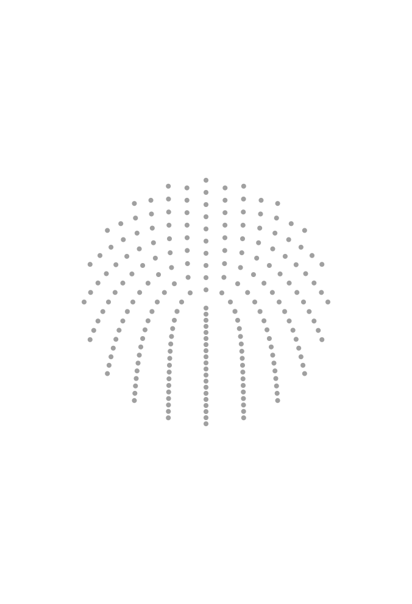

# Twisting Orbits

Интерактивная генеративная визуализация орбитального поля на Canvas. Точки равномерно распределяются по концентрическим орбитам вокруг центра, а параметр закручивания смещает каждую орбиту на угол, пропорциональный её радиусу, — создавая эффект закрученной спирали.



## Запуск

```bash
npm install
npm run dev
```

Откройте `http://localhost:5173/canvas.html`.

## Управление

| Элемент                    | Описание                                                                             |
| -------------------------- | ------------------------------------------------------------------------------------ |
| **Закручивание**           | Угловое смещение орбит — от 0 (концентрические круги) до максимума (плотная спираль) |
| **Количество орбит**       | Число концентрических орбит в сцене; также задаёт максимум ползунка закручивания     |
| **Шаг орбит**              | Расстояние между соседними орбитами в пикселях                                       |
| **Отображать орбиты**      | Показывает направляющие окружности под точками                                       |
| **▶ / ⏸**                  | Запуск и пауза анимации — непрерывно вращает закручивание                            |
| **Экспорт в SVG**          | Сохраняет текущий кадр в формате SVG (недоступно во время анимации)                  |
| **Двойной клик по панели** | Скрывает панель управления                                                           |
| **☰**                     | Возвращает панель управления                                                         |

## Стек

- **TypeScript** — без этапа компиляции, Vite транспилирует на лету
- **Canvas 2D API** — рендеринг сцены
- **canvas2svg** — экспорт в SVG
- **Vite** — dev-сервер и сборка
